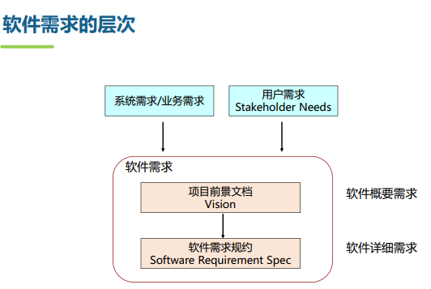

[TOC]

## 软件需求

### 1. 概述

软件需求定义：**FURPS+  p97**

* 易用性需求 
   Training time requirements, measurable task times 
   User abilities (beginner/advanced) 
   Comparison to other systems that users know and like 
   Online help systems, tool tips, documentation needs 
   Conformity with standards 
  		• Examples: Windows, style guides, GUI Standards

* 可靠性需求
   Availability (xx.xx%)
   Accuracy
   Mean time between failures (xx hrs)
   Max. bugs per/KLOC (0-x)
   Bugs by class - critical, significant, minor 

* 性能需求
   Capacity
   Throughput
   Response time
   Memory
   Degradation modes
   Efficient use of scarce resources
  • Processor, memory, disk, network bandwidth 

* 支持性需求
   Languages, DBMS, tools, etc.
   Programming standards
   Error handling and reporting standards
  常常难以定义

> 请问以下需求各属于哪类需求？
>
> 1. 系统支持百万级的用户并发访问：**性能需求**
> 2. 系统每月宕机不超过1次（**故障**）：**可靠性需求**
> 3. 系统每天用户不可用的时间不超过1分钟（**Availability**）：**可靠性需求**
> 4.  系统不易被黑客入侵：**功能需求/安全需求**（没有安全就并入功能）
> 5. 系统可以方便增加各种增值服务：**维护性需求（可支持性）**
> 6. 系统应在2023年5月1日上线 ：**设计约束**

**层次p98**

**优秀需求的特性p99**

> 这些需求可验证吗？
>
> The system supports up to 1,000 simultaneous users（并发用户）：**不可验证**（不够完整）
> The system shall respond to an arbitrary query in 500 msec.：**不可验证**（不够完整，需要：并发用户，响应时间，数据量，软硬件配置）
> The color shall be a pleasing shade of green：**不可验证**（太主观）
>
> The system shall be available 24h x 7（可靠性）：**不可验证**（不能达到100%）
> The system shall export view data in comma-separated format ：**不可验证**（格式没有定义清楚）

**需求工程5阶段p100**

### 2. 需求获取

1）分析问题及根源 ；2）识别项目涉众；3）识别项目的约束 ；4）获取常用术语；5）识别需求的来源 ；6）收集需求 ；7）产品定位 ；8）撰写产品特性；9）定义质量范围  ；10）定义文档需求 ；11）建立项目范围 ；12）划分特性优先级 

**前景文档**（Vision）**p105**

### 3. 分析和建模

**分析建模准则p104**

**面向对象分析步骤**

* 建立用例模型
  * 1.1识别actor和use case，画Use-Case图 **p118**
  * 1.2 编写Use-Case Spec. **p130**
  * 1.3 优化Use-Case图的结构 
* 建立概念模型
  * 2.1识别Conceptual Class **p141**
  * 2.2建立Conceptual Class之间的关系 ****
  * 2.3增加 Conceptual Class的属性，画状态图 
* 建立分析模型
  * 3.1 识别用例实现
  * 3.2 针对每个用例实现：分系列、时序图通信图，分析类

**用例图关系示例图 p135** 

#### 类关系

* 关联Association
  * 聚合Aggregation
  * 组成Composition
* 泛化Generalization
* 依赖Dependency

1. 关联

* 聚合：“是一个部分”的关系
  * 公司和雇员
  * 汽车和轮胎（轮胎可以装载另一个汽车）
  * 父亲和女儿（父亲拥有女儿）
* 组合：强所有权，一致生命周期
  * 订单和订单项
  * 整车销售中的：汽车和轮胎
* 丈夫和妻子：关联

2. 泛化

单继承和多继承

* 泛化：“is a”、“kind of”
* 聚合：“part of”（父女）

子类型应该能替换基类型：圆不是点的子类，“三点组成三角形”中不能替换

3. 依赖

调用关系，临时的（调用的时候有），分析类的时候不画

* Local Variable Visibility ：函数本地变量
* Parameter Visibility ：参数类型、返回值类型
* Global Visibility 

**概念类例子p142**

**状态机图p212**

#### 分析模型

**分析类3种 p143**

**时序图、通讯图 P146**

从时序图画类图：**VOPC p148**

### 4. 需求定义和验证

p104

### 5. 需求管理

1）定义需求基线
2）需求变更控制和版本控制（建立新的需求基线）
3）需求跟踪 

## 软件架构设计

### 1. 原则

抽象和分解，模块化设计 p153

**软件模块化的好处**
 把复杂软件变简单，更易实现
 把易变的部分和稳定的部分分开，模块可插拔可替换，应对需求变更和技术升级（在计算机中， CPU是常变的模块，键盘是相对稳定的模块）
 支持多人协同开发
 支持迭代式开发
 模块复用和模块组装，加快开发时间，节省开发费用，提高产品质量
 促进形成大规模开发的软件产业－软件工厂 

**内聚耦合p154**

### 2. 设计步骤和复用

设计步骤：**P151**

* 架构设计
  * 独立于面向对象、结构化等方法进行设计，可采用AADL等可视化建模语言进行刻画。
* 详细设计 (Detail Design)
  * 将模块进一步细分：子模块－子子模块－ 
    * 原子模块为类、函数、过程等
  * 为所有数据对象定义详细的数据结构
  * 为所有在模块内发生的处理定义算法细节、控制流和数据流 

软件设计的**质量要求**
1. 设计应当模块化，高内聚、低耦合。
* 支持多人合作开发
* 易于测试和修改
* 能够以演化过程实现
2. 设计应当包含数据、体系结构、接口和构件的清楚的表示。
3. 设计应根据软件需求采用可重复使用的方法进行。
4. 应使用能够有效传达其意义的表示法来表达设计模型。 

**7种软件设计的坏味道**
**1）僵化性（Rigidity）**
 很难对软件进行改动，因为每个改动都会迫使对系统其他部分的许多改动
**2）脆弱性（Fragility）**
 对系统的改动会导致系统中和改动的地方在概念上无关的许多地方出现问题
**3）牢固性（Immobility）**
 很难解开系统中某部分与其它部分之间的纠结，从而难以使其中的任何部分可以被分离出来被其它系统复用 
**4）粘滞性（Viscosity）**
 做正确的事情要比做错误的事情困难。表现为两种形式：
• 软件粘滞性：需要对软件进行修改时，可能存在多种方法。有的方法可以保持原有的设计质量，另一些方法则会破坏原有的设计质量。如果，破坏软件质量的修改比保持原有设计质量的修改更容易实施时，我们就称该软件具有“软件粘滞性”。
• 环境粘滞性：当开发环境迟钝、低效时，就会产生环境粘滞性。例如：如果编译时间很长，那么开发人员可能会放弃那些能保持设计质量，但是却需要导致大规模重新编译的改动。
**5）不必要的复杂性（Needless Complexity）**
 设计中包含不具有任何好处的基础结构。
**6）不必要的重复（Needless Repetition）**
 设计中包含一些重复的结构，这些结构本来可以通过单一的抽象进行统一
• 使用Cut/Copy/Paste实施源代码级的软件复用容易导致这一问题
• 这种代码级别的冗余，将带来修改上的问题
**7）晦涩性（Opacity）**
 很难阅读和理解，不要相信你永远都会如此清楚的了解你的每一行代码，“时间会冲淡一切”。要站在阅读者的角度进行设计  

设计臭味导致的问题：难以变更，难以理解，难以复用

**软件设计的模式分类**：架构风格，设计模式，编程惯用ldiom

**架构风格p166**

### 3. 架构设计

多个视图：部署（物理）视图、逻辑视图、实现试图、技术试图、进程视图

* 部署：针对分布式系统，需要定义架构的部署视图,刻画计算机或处理节点以及网络间的关系。 
  * 如1. B/S架构 2. C/S架构 

部署架构风格
 Client/Server
 3-tier
 Fat Client
 Fat Server
 Distributed Client/Server
 Serverless
 Peer-to-peer (P2P) 

* 逻辑：把软件划分为多个模块（又称构件），模块和模块相互协作，共同完成软件的需求规约。这些模块将部署在物理架构的同一节点或不同节点上。
   重点考虑功能、可维护性等需求的支持。
   所有软件都需要定义逻辑架构 

逻辑架构风格
 表现层分离风格： MVC
 数据流风格 (Dataflow)：批处理序列、管道－过滤器风格 (Pipe-and-Filter)
 调用/返回风格：主程序/子程序、面向对象风格 (ADT)、多层 (Layer)
 分布计算风格：多层（Tier)、代理、 C/S、 P2P
 独立构件风格：事件响应、消息总线、微服务
 虚拟机风格：解释器、基于规则的系统
 仓库风格：数据库系统、超文本系统、黑板系统
 自适应风格：微内核、反射、控制反馈 

#### 层次架构风格Layer

附件：架构风格