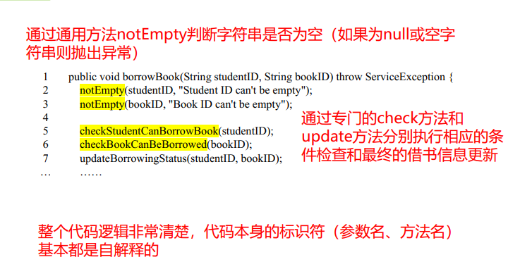

[TOC]

## 软件详细设计

### 1. 面向对象设计原则

附件：设计原则

1. 单一职责原则SRP
2. 里氏替换原则LSP
3. 依赖倒置原则DIP
4. 接口隔离原则ISP
5. 开-闭原则OCP
6. 组合/聚合复用原则CARP 

### 2. GoF设计模式 p180

**Interpreter**模式注重封装**特定领域变化**，支持领域问题的频繁变化
**Template Method**模式注重封装算法结构，支持**算法子步骤变化**
**Chain of Responsibility**模式注重封装对象责任，支持**责任的变化**
**Command**模式注重将请求封装为对象，支持**请求的变化**
**Iterator**模式注重封装集合对象内部结构，支持**集合的变化**
**Strategy**模式注重封装算法，支持**算法的变化**
**Mediator**模式注重封装对象间的交互，支持**对象交互的变化**
**Memento**模式注重封装对象状态变化，支持**状态保存/恢复**
**Observer**模式注重封装对象通知，支持**通信对象的变化**
**State**模式注重封装与状态行为相关的行为，支持**状态的变化**
**Visitor**模式注重封装**对象操作变化**，支持在运行时为类层次结构动态添加新的操作。 

## 用户界面设计

**原则 p200**

### 1. 人机交互方式

**命令行**：
 优点：非常灵活，命令通常有许多选项或参数，并且它可以同时应用于许多对象，使其对重复性任务有用。
 不足：命令的学习和使用成本比较高，需要培训，使用时经常出错。 

**菜单**
 优点：因为这些选项是可见的，所以它们对用户的要求较低，依赖于识别而不是回忆。
 不足：菜单选项仍然需要有意义并且逻辑上分组以帮助识别。 

**表格**
 表单主要用于数据输入，也可用于数据检索应用。
 在填表时，用户必须理解字段的标题，知道值的允许范围和数据输入方法，能够对出错信息做出反应。
 这种交互方式对新用户或专家用户来说**都是合适的**。 

**WIMP界面**
 WIMP指的是windows, icons, menus和pointers的窗口界面，是当今大多数交互式计算机系统的默认界面样式，尤其是在PC和桌面工作站领域。
 它使用鼠标等光标移动设备，通过指向可视对象与动作，用户可以迅速执行任务和立即观察结果。
 优点：任务概念可视化，容易学习，可对用户操作快速做出反馈。
 不足：不适合小屏幕设备，不具有自解释性。 

**自然语言交互**
 计算机采用自然语言处理和人工智能技术理解用户用自然语言（包括键盘输入文本、手写文字、语音输入等）表达的请求，并把系统的理解转换成系统语言，然后执行相应的应用功能。
 优点：用户无需学习训练就能以自然交流方式使用计算机
 不足：输入冗长文字，自然语言语义有二义性，需要具有应用领域的知识基础 

**问答和对话**
 对话机器人，最简单的人机交互方式，已成为非常有前途的发展方向：基于大模型**ChatGPT**的全领域知识问答
 一种是用户回答问题，另一种是用户提出问题，由系统进行回答。
 优点：记忆要求低，具有自解释性，将任务流程以简单的线性表示。 

**可穿戴技术**
 视线、肢体动作、脸部表情…… 

**可植入设备** 

### 3. 设计过程

p202

**用户分类**：
 外行型：不熟悉计算机操作，对系统很少或毫无认识
 初学型：对计算机有一些经验，对新系统不熟悉，需要相当多的支持
 熟练型：对系统有丰富的使用经验，能熟练操作，但不了解系统的内部结构，不能纠正意外错误，不能扩充系统的能力
 专家型：了解系统内部的结构，有系统工作机制的专门知识，具有维护和修改系统的能力，希望为他们提供具备修改和扩充系统能力的复杂界面 **（程序员）**

> 以下系统的用户具有什么特点？应有采用什么界面风格？
>  POS系统：熟练型用户（营业员），界面单调，快捷键操作
>  ATM系统：界面简单、全年龄客户、多国语言
>  银行前台柜员系统：熟练型用户，功能丰富，一个业务尽量不切换窗口
>  银行后台管理系统 ：专家型（IT人员），批处理，命令行

### 4. 设计要素

p203 +

7）合理的布局和合理的色彩 

8）移动界面设计的问题 ：尺寸小，减少文本输入；移动设备种类多，自适应型；用户的层次、爱好、习惯众多，个性化；场景的改变

## 编码和版本管理

书12.3-4

高级程序设计语言的分类

* 命令式（imperative） 语言
  * 结构化语言 C, Ada, Fortran …
  * 面向对象语言 Smalltalk, Eiffel, C++, Java …
  * 脚本语言 Perl, Python, PHP…
* 说明式（declarative）语言
  * 函数式 Lisp/Scheme, ML, Haskell, Clean, Erlang, Miranda…
  * 数据流 Id, Val …
  * 逻辑式 或基于约束的 Prolog, spreedsheets …
  * 基于模板的 XSLT …
* 量子（quantum）编程语言
  * Q#, Quipper, Sliq 

**语言选择**举例
 如果编写对**性能**要求苛刻，或和操作系统结合紧密的程序，必然选择c。
 如果需要**跨平台**，又要广泛的支持的话，选择java。
 编写**服务器端程序**，用Java 、 JavaScript 、 php、 perl、 python、 asp。
 编写**客户端程序**，最常用的是JavaScript。
 编写**机器学习**软件采用python、 R、 Java
 编写**数据库程序**最简单的语言是vb或delphi。
 编写**知识的处理程序**用prolog。
 编写**最灵活，最模糊**的程序用lisp。
 编写**office**程序用vba。
 如果只作为简单应用的工具语言， python和ruby是更好的选择，他们的跨**平台移植性**好，应用也比较广泛，语言简单，生产率高。 

**代码评审**(code review)
 评审内容：从设计、功能、复杂性、测试、实现逻辑、异常处理、编码规范等方面评价代码的质量
