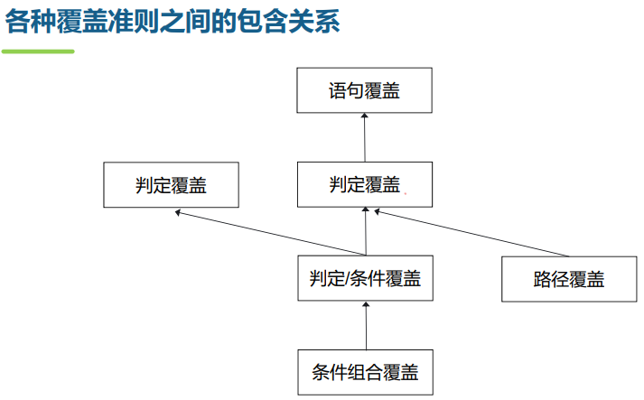

[TOC]

## 软件测试

p243

**单元测试经验**：测试驱动开发
 编写单元测试用例促进解除模块之间的耦合。先编写测试用例，强迫自己从利于调用者的角度来设计单元，关注单元的接口。为了便于调用和独立测试，必须降低单元和周边环境的耦合程度，单元的可测试性得到加强，模块化程度得到提高。这样单元的可重用性也容易被考虑和提高。 

**集成测试**针对的主要错误来源
 数据在穿越软件模块之间的接口传递时发生丢失或明显延迟（例如通过网络传输）
 不同软件模块对参数或值存在不一致的理解，这种问题不会导致软件模块之间调用或通信失败，但可能导致不一致的处理逻辑
 软件模块由于共享资源或其他原因而存在相互影响和副作用
 软件模块交互后进行计算的误差累计达到了不能接受的程度，或者接口参数取值超出取值范围或者容量
 全局数据结构出现错误，使得不同软件模块之间无法按照统一的标准进行计算
 软件模块使用未在接口中明确声明的资源时，参数或资源造成边界效应 

**白盒测试**

* 控制流测试p257
* 基本路径测试

**黑盒测试** (功能测试、行为测试 )

1）等价类划分法**p261**
2）边界值分析法
3）判定表法 **p267**

4）错误推测法  p265

**综合运用多种黑盒测试用例设计策略**
 对输入和输出划分有效的和无效等价类；
 使用边界值分析法进行补充；
 如果规范中含有输入条件的组合，采用判定表；
 使用错误“猜测”技巧，增加一些测试用例。 

**系统测试技术**

附件：测试技术

其他：p253

**测试过程** p275

**设计测试用例： 测试用例（test case）是按一定顺序执行的与测试目标相关的一系列测试。其主要内容包括
 前置条件 (Pre-conditions) Optional
 测试输入 (Test input)
 观察点 (Observation Points) Optional
 控制点 (Control Points) Optional
 期望结果 (Expected Results)
 后置条件 (Post-conditions) Optional 

**主要测试度量指标 ** 

 测试中发现的全部缺陷数
 客户发现的全部缺陷数
 缺陷检测有效性：测试中发现的全部缺陷数 /（测试中发现的全部缺陷数+客户发现的全部缺陷数）
 缺陷排除有效性：测试中改正的全部缺陷数 / 测试中发现的全部缺陷数
 测试用例设计效率：测试中发现的全部缺陷数 / 运行的测试用例数
 缺陷密度 = 缺陷数 / 软件规模
 **覆盖率**： 测试需求覆盖率、测试执行覆盖率、用例通过覆盖率、代码覆盖率、功能覆盖率
 缺陷分布：按测试时间（趋势）、按测试一定周期、按软件开发组、按缺陷严重性、按缺陷状态 

## 软件运维

**维护类型 p285**

**DevOps**：（Development & Operations）开发运维一体化
 （持续交付）快速实现一行代码的变更，到软件交付到用户手中
 （自动化）从代码提交到最终交付用户只需要按下按钮，自动化每一个工作环节，及时收到用户反馈 

**软件部署策略**
 **停机部署**（big bang deployment）
 **蓝绿部署**（blue-green deployment）
在生产线上部署相同数量的新版本服务。旧版本的生产环境称为蓝环境，用于对外提供软件服务；新版本的预发布环境称为绿环境，用于对新版本进行测试。
 **灰度部署**（canary deployment）
又称为金丝雀部署新版本进行增量部署，先部署一部分，通过路由器配置将用户流量引流至新版本部署中；如果没有问题，再部署和引流一部分，直到全部部署和引流完成 

## 软件项目管理

**项目** p297

**敏捷项目管理的最佳实践 **

* **迭代开发与小型发布**
   强调在非常短的周期内以递增的方式发布新版本，从而可以很容易地估计每个迭代周期的进度，便于控制工作量和风险； 同时，也可以及时处理用户的反馈。
   每个迭代必须要有executable release
   迭代结束后进行迭代评审与评估 
* **滚动式规划**
   立项建议书中有整体项目计划：粗粒度、以迭代为单位
   N个迭代计划：细粒度（例如1~2天）、以任务为单位；每个迭代开始前（或上个迭代结束时）编写迭代计划；每个迭代结束后编写迭代评估报告 
* 每日立会
   每日15分钟简会
   时间固定、场地固定
   会议内容：昨天做了什么？今天准备做什么？遇到什么问题
   • 问题的解决方案不在会上讨论 

**高效团队的九个特征**：外部支持，一致的承诺，开放的沟通，相关的技能，相互的信任，有效的结构，分享成果，恰当的领导，清晰的目标 

**最差实践**
 采用瀑布模型，而不采用迭代过程
 过程过重，开发效率低下
 不重视设计，从而导致大量返工
 不进行需求评审和设计评审，不重视测试，从而导致质量低下
 文档只作为应付领导与客户的手段，与实际开发不一致
 不进行风险管理，从而导致项目失败
 不进行持续集成，集成放在最后几天，从而导致化大量时间在集成上，或者无法集成 

