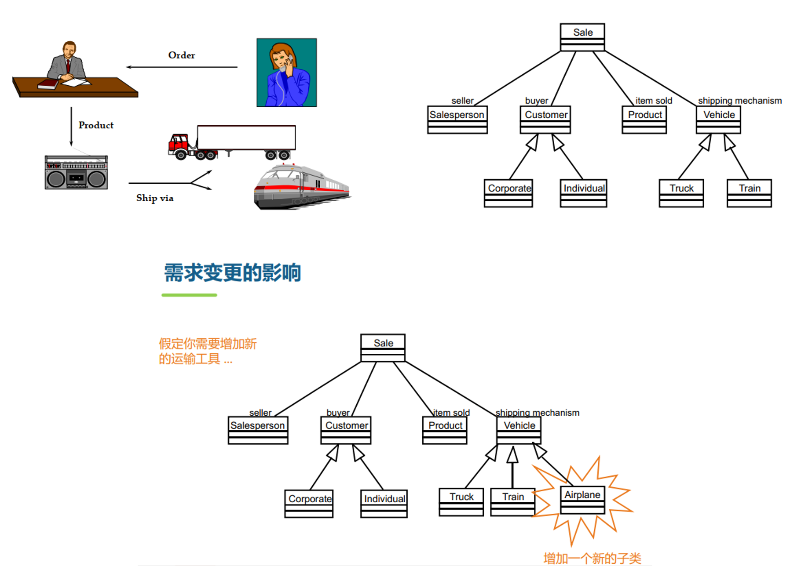

[TOC]

## 软件过程

### 1. 软件生命周期模型

软件开发的生命周期

#### 1.1 瀑布模型 p20

**特点**
强调阶段的划分及其顺序性
强调各阶段工作及其文档的完备性
每个阶段结束之前，都从技术和管理两个角度进行严格的审查
是一种严格线性的、按阶段顺序的、逐步细化的开发模式

**适用时机**
所有功能、性能等要求能一次理解和描述时
所有的系统功能一次交付时
必须同时淘汰全部老系统时 

**价值**
结构简单明了；历史较长、应用面广泛、为广大软件工作者所熟悉；已有与之配套的一组十分成熟的开发方法和丰富的支撑工具。
一种较为有效的管理模式：订计划、成本预算、组织开发人员,阶段评审,文档管理,从而对软件质量有一定的保证。

**风险**
获得完善的需求规约是非常困难的；
难以适应快速变化需求；
系统太大时,难以一次做完；
反馈信息慢；
极可能引起开发后期的大量返工，如返工到需求、设计等早期活动。

#### 1.2 增量模型 p22

**需求和架构确定后，增量式进行开发，构造一系列可执行的版本(Version by Version)** 

**风险**
需求未被很好地理解
一次要求所有功能
需求迅速发生变化
事先打算采用的技术迅速发生变化
长时期内仅有有限的资源（人员/资金）

**使用时机**
需要早期获得所有需求；
根据需求建立稳定的软件架构；
中间产品可以提供使用；
系统被自然地分割成增量；
工作人员/资金可以逐步增加。

#### 1.3 演化模型 p23

**特点**
迭代的开发方法，渐进地开发各个可执行版本，逐步完善软件产品。每个版本在开发时，开发过程中的活动和任务顺序地或部分重叠平行地被采用。
与增量模型的区别是：需求在开发早期不能被完全了解和确定，在一部分被定义后开发就开始了，然后在每个相继的版本中逐步完善。

**演化模型举例**
每次迭代都包括计划、需求、设计、编码、测试、总结等活动
每次迭代都应产生一个可执行的软件版本
基于风险，规划迭代。风险越高的工作，越在早期的迭代中执行
迭代可以并行、重叠、串行
迭代内部的活动可以交叉并行 

现代软件过程都采用演化模型：统一软件过程RUP，敏捷过程 （SCRUM、 XP等），净室（Cleanroom）软件过程
演化模型的“子类”：原型 Prototyping，螺旋模型 Spiral Model **p24**

### 2. RUP & 敏捷过程

统一软件过程RUP p27

敏捷过程p31

**敏捷宣言**
较之于过程和工具，更注重人及其相互作用的价值
较之于无所不及的各类文档，更注重可运行的软件的价值
较之于合同谈判，更注重与客户合作的价值
较之于按计划行事，更注重响应需求变化的价值 

**Scrum p35**
Sprint：周期为30天的迭代
Backlog：待办事项表（功能和非功能需求清单）
Daily Scrum：每日15分钟简会 

## 软件建模

### 1. 模型 p47

有用模型的特征
**抽象性**：突出重点方面，去除无关紧要的细节
**可理解性**：模型的表达方式能被模型的观察者很容易地理解
**精确性**：忠实地表达被建模的系统
**说明性**：能够被用来对被建模系统进行直观地分析，并得出正确的结论
**经济性**：模型的建立和分析比被建模系统更廉价，更经济
作为有用的工程模型, 必需具备以上所有特征! 

> 举例：UML 的软件模型视图
>
> * **需求**
>   * 用例图 Use Case diagram
> * **结构**
>   * 本体论: 类图 Class diagram
>   * 实例: 对象图 Object diagram
> * **行为**
>   * 状态图 Statechart diagram
>   * 活动图 Activity diagram
>   * 交互：顺序图和协作图 Sequence diagram & Collaboration diagram
> * **实现**
>   * 构件图 Component diagram
>   * 部署图 Deployment diagram 

#### 习题

> **A  model ...?**
> A. ls not necessary when team members understand their job.
> B. Has to be structural AND behavioral.
> C. Is a simplification of reality.
> D. ls an excuse for building an elaborate plan.

C模型是现实世界的简化

> **Why do we model?**
> A. Helps to visualize a system
> B. Gives us a template for constructing a system
> C. Documents our decisionsD.All of the above
> Answer: D

### 2. 建模方法

preview：
形式化方法 (Formal Method)
结构化方法 (Structured Method)
面向对象方法 (Object Oriented Method)
基于构件的软件开发方法 (Component Based Software Development)
面向服务方法 ( Service Oriented Method)
模型驱动的开发方法 (Model-Driven Development)
软件生产线方法（Software Product Line） 

#### 形式化方法 p88

形式化方法是**基于数学**的技术开发软件，如**集合论、模糊逻辑、函数**。
形式化方法的**好处**：无二义性、 一致性、正确性、完整性 

> 举例：加一个块集合到队列的尾部, 采用Z语言
>
> --------AddBlock-----------------
> △BlockHandler
> Ablocks？： P BLOCKS
> \---------------------------------------
>
> Ablocks？包含于 used
> BlockQueue'=BlockQueue⌒ 〈Ablocks？〉
> used'=used∧
> free'=free
>

**不足**：（尚未成为主流的开发方法，实践和应用较少 ）
 形式化规约主要关注于功能和数据，而问题的时序、控制和行为等方面却更难
于表示。此外，有些问题元素(如，人机界面)最好用图形技术来刻划。
 使用形式化方法来建立规约比其他方法更难于学习，并且对某些软件实践者来说它代表了一种重要的“文化冲击”。
 难以支持大的复杂系统。

#### 结构化方法 p49

**核心**: 数据和处理
**手段**:自顶向下，逐步求精、模块化

常用建模工具:

* 需求建模
  *  DFD(数据流图) 、 DD(数据字典)、 ERD(实体关系图)、 STD(状态图)
* 设计建模
  * 结构图（SC）
  * 流程图、 N-S图、 PAD图、伪代码 

**结构化分析**：p55，实例p60

#### 面向对象方法(UML) p62

示例：销售订单

UML图 p66

#### 基于构件的开发方法 p67

**构件**是软件复用的重要手段，是核心和基础，构件由**构件规约**与**构件实现**两部分组成 

流程图p72

#### 面向服务的方法 p76

服务的抽象性（基于接口的编程）
服务的自治性（实现分布式应用）
服务间的松耦合式绑定，基于标准化消息进行通信
服务的自描述性（支持动态发现与延迟绑定）
服务的粗粒度（支持基于业务逻辑的积木式装配） 

三种角色协作图p76

#### 模型驱动的开发方法 p81

以**模型**为中心（相对于以代码为中心）的软件开发方法
基于以下两种久经考验的技术 ：抽象（建模语言）&自动化（自动化）

开发方法之一：PIM到PSM的转换

#### 软件产品线方法

所谓软件产品线，它是共享一组公共受控特征，满足特定市场需要，并且按照预定方式在相关核心资产基础上开发而成的一系列软件系统。
一条产品线是共享一组共同设计及标准的产品族（Product Family），这些产品属于同一领域，具有公共需求集，可以根据特定的用户需求对产品线体系结构进行定制，在此基础上通过可复用构件和特定应用构件的组装得到。 

### 